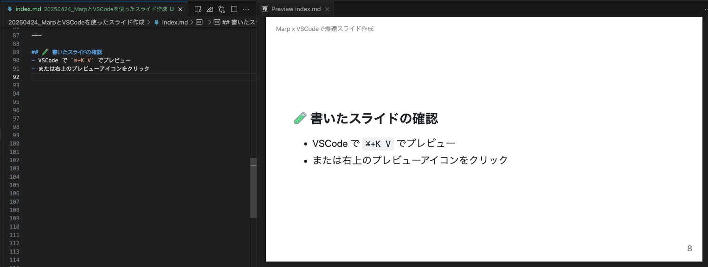

<!-- _class : lead -->

# 💥 VSCodeで爆速スライド作成

## Marpを使ったmarkdownスライドの作り方

---

## 🌟 今日話すこと

- Marp とは？
- VSCode との連携方法
- 実際のスライド作成フローs
- まとめ

---

## ◿◿ Marp とは？


https://marp.app/

---
## ◿◿ Marp とは？
- Markdown でスライドが作れるツール
- プレゼン資料を **Gitで管理** できる
- CLIにより、PDF・HTML などの形式で出力可能
- テーマも充実

---

## 🔌 VSCode との連携

### 1. 拡張機能をインストール

- VSCode で「Marp for VS Code」を検索してインストール
- `.md`ファイルをスライドとしてプレビュー可能になる

### 2. あとはmdファイルに書くだけ

---

## ✏️ 実際の記述方法（一部省略）

```
---
marp: true
---

# 💥 VSCodeで爆速スライド作成
## Marpを使ったmarkdownスライドの作り方

---

## 🌟 今日話すこと

- Marp とは？
- VSCode との連携方法
- 実際のスライド作成フロー
- よく使う記法と Tips
- まとめ

---
```

---

## 📀 レイアウト指定やカスタム

| 機能           | 記法例                  |
| -------------- | ----------------------- |
| スライド区切り | `---`                   |
| ページ番号     | `paginate: true`        |
| テーマ設定     | `theme: gaia / default` |
| ヘッダー     | `header: 'Slide Title'` |
| フッター     | `footer: '@hogehoge'` |

---

## 🧪 書いたスライドの確認

- `⌘+K V` で簡単プレビュー
- または右上のプレビューアイコンをクリック



---

## 📤 出力方法

npxならインストール不要ですぐ使える
```bash
# htmlで出力
npx @marp-team/marp-cli@latest slide.md

# pdfで出力
npx @marp-team/marp-cli@latest slide.md --pdf
```

brewからのインストールも可能（自分はこっち）
```bash
# インストール
brew install marp-cli

# pdf出力実行
marp slide.md --pdf
```

- 出力オプションとして `--pptx` もある

---

## 🎉 まとめ

- Markdown でスライド作成！
- VSCode で確認しながら編集できる
- お気に入りのフォーマットで出力
- Gitでバージョン管理！再利用も楽々！

---

## 🙌 Let's try Marp!

Marp × VSCode で、\
**プレゼン準備を爆速短縮しよう！**

---

# ご清聴ありがとうございました 🙏

---
## 🚩公式
- [Marp](https://marp.app/)
- [Marp for VS Code](https://marketplace.visualstudio.com/items?itemName=marp-team.marp-vscode)
- [marp-cli](https://github.com/marp-team/marp-cli)


## 💫影響を受けた資料
- [Markdown でスライドを作れる Marp はいいぞ](https://qiita.com/tomoasleep/items/604107787d92dec4868e)
- [爆速できれいな LT スライド作りを支える技術](https://zenn.dev/su8ru/articles/marp-cli-lt-slide)
- [Markdownから簡単にスライドを作成する「Marp(Marpit)」](https://tracpath.com/works/development/marp/)