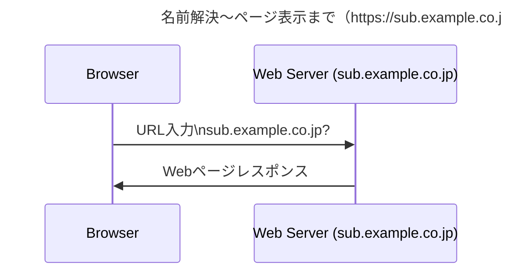
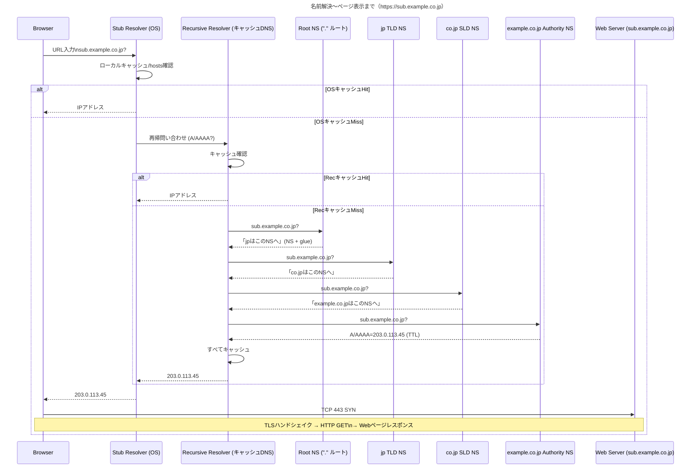
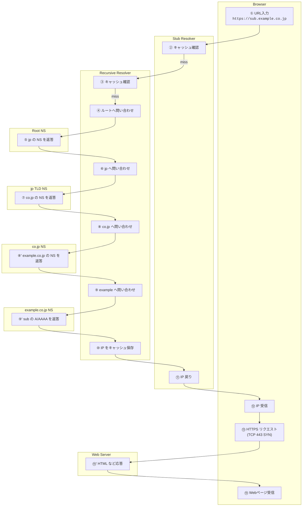
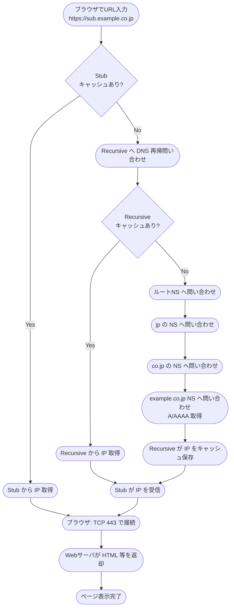

当初のイメージ

```mermaid
sequenceDiagram
    title 名前解決～ページ表示まで（https://sub.example.co.jp）元々のイメージ
    participant Browser
    participant Web as Web Server (sub.example.co.jp)

    %% URL入力
    Browser->>Web: URL入力\nsub.example.co.jp?
    Web->>Browser: Webページレスポンス

```

実態

```mermaid
sequenceDiagram
    title 名前解決～ページ表示まで（https://sub.example.co.jp）

    participant Browser
    participant Stub as Stub Resolver (OS)
    participant Rec as Recursive Resolver (キャッシュDNS)
    participant Root as Root NS ("." ルート)
    participant JP as jp TLD NS
    participant COJP as co.jp SLD NS
    participant Auth as example.co.jp Authority NS
    participant Web as Web Server (sub.example.co.jp)

    %% URL入力
    Browser->>Stub: URL入力\nsub.example.co.jp?
    Stub->>Stub: ローカルキャッシュ/hosts確認

    alt OSキャッシュHit
        Stub-->>Browser: IPアドレス
    else OSキャッシュMiss
        Stub->>Rec: 再帰問い合わせ (A/AAAA?)
        Rec->>Rec: キャッシュ確認
        alt RecキャッシュHit
            Rec-->>Stub: IPアドレス
        else RecキャッシュMiss
            Rec->>Root: sub.example.co.jp?
            Root-->>Rec: 「jpはこのNSへ」(NS + glue)
            Rec->>JP: sub.example.co.jp?
            JP-->>Rec: 「co.jpはこのNSへ」
            Rec->>COJP: sub.example.co.jp?
            COJP-->>Rec: 「example.co.jpはこのNSへ」
            Rec->>Auth: sub.example.co.jp?
            Auth-->>Rec: A/AAAA=203.0.113.45 (TTL)
            Rec->>Rec: すべてキャッシュ
            Rec-->>Stub: 203.0.113.45
        end
        Stub-->>Browser: 203.0.113.45
        Browser->>Web: TCP 443 SYN
        Note over Browser,Web: TLSハンドシェイク → HTTP GET\n→ Webページレスポンス
    end
```

----
スイムレーン版
わりとわかりやすいかも

```mermaid
flowchart TB
    %% ─────────── レーン定義 ───────────
    subgraph Browser["Browser"]
        direction TB
        B1["① URL入力<br><code>https://sub.example.co.jp</code>"]
        B2["⑫ IP 受信"]
        B3["⑬ HTTPS リクエスト\n(TCP 443 SYN)"]
        B4["⑭ Webページ受信"]
    end

    subgraph Stub["Stub Resolver<br>(OS)"]
        direction TB
        S1["② キャッシュ確認"]
        S2["⑪ IP 戻り"]
    end

    subgraph Rec["Recursive Resolver<br>(キャッシュDNS)"]
        direction TB
        R1["③ キャッシュ確認"]
        R2["④ ルートへ問い合わせ"]
        R3["⑥ jp へ問い合わせ"]
        R4["⑧ co.jp へ問い合わせ"]
        R5["⑨ example へ問い合わせ"]
        R6["⑩ IP をキャッシュ保存"]
    end

    subgraph Root["Root NS"]
        direction TB
        RT["⑤ jp の NS を返答"]
    end

    subgraph JP["jp TLD NS"]
        direction TB
        JP_R["⑦ co.jp の NS を返答"]
    end

    subgraph COJP["co.jp NS"]
        direction TB
        CO_R["⑧′ example.co.jp の NS を返答"]
    end

    subgraph AUTH["example.co.jp NS"]
        direction TB
        AU_R["⑨′ sub の A/AAAA を返答"]
    end

    subgraph Web["Web Server<br>(sub.example.co.jp)"]
        direction TB
        W1["⑭′ HTML など応答"]
    end

    %% ─────────── フロー矢印 ───────────
    B1 --> S1
    S1 -- miss --> R1
    R1 -- miss --> R2
    R2 --> RT
    RT --> R3
    R3 --> JP_R
    JP_R --> R4
    R4 --> CO_R
    CO_R --> R5
    R5 --> AU_R
    AU_R --> R6
    R6 --> S2
    S2 --> B2
    B2 --> B3
    B3 --> W1
    W1 --> B4

```

----
フローチャート版

```mermaid
flowchart TD
    %% ────────── ノード定義 ──────────
    A([ブラウザでURL入力<br>https://sub.example.co.jp])
    B{Stub<br>キャッシュあり?}
    C1([Stub から IP 取得])
    C2([Recursive へ DNS 再帰問い合わせ])
    D{Recursive<br>キャッシュあり?}
    E1([Recursive から IP 取得])
    %% ルート → jp → co.jp → 権威
    R1([ルートNS へ問い合わせ])
    R2([jp の NS へ問い合わせ])
    R3([co.jp の NS へ問い合わせ])
    R4([example.co.jp NS へ問い合わせ<br>A/AAAA 取得])
    F([Recursive が IP をキャッシュ保存])
    G([Stub が IP を受信])
    H([ブラウザ: TCP 443 で接続])
    I([Webサーバが HTML 等を返却])
    End([ページ表示完了])

    %% ────────── フロー矢印 ──────────
    A --> B
    B -- Yes --> C1
    C1 --> H

    B -- No --> C2
    C2 --> D
    D -- Yes --> E1
    E1 --> G

    D -- No --> R1
    R1 --> R2
    R2 --> R3
    R3 --> R4
    R4 --> F
    F --> G
    G --> H
    H --> I
    I --> End

```