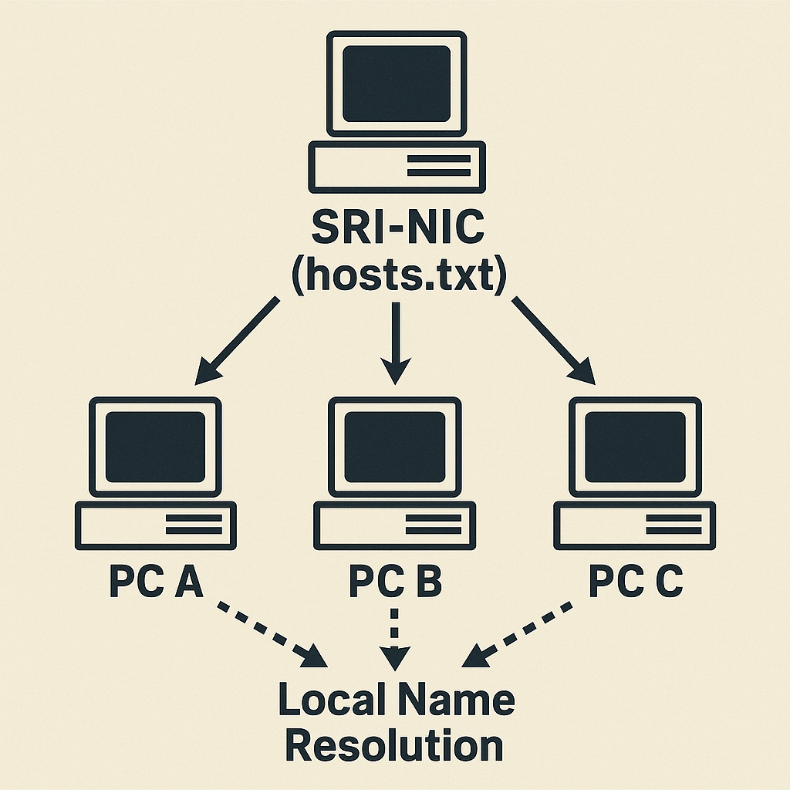
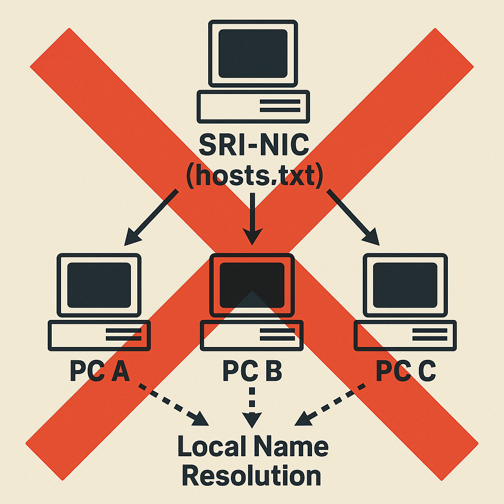

<!-- タイトル用書式：色反転＋中央寄せ -->
<!-- _class : lead invert-->

# DNS とは？<br>〜DNS の役割と生まれた理由〜

# DNS とはどのようなシステムか

<!-- _class : lead-->

# DNS とはどのようなシステムか

## DNS = Domain Name System

# DNS とはどのようなシステムか

## DNS = Domain Name System

## = ドメイン名システム

# DNS とはどのようなシステムか

## DNS = Domain Name System

## = ドメイン名システム

直訳だとよくわからない...

# DNS とはどのようなシステムか

_[Domain Name System | wikipedia](https://en.wikipedia.org/wiki/Domain_Name_System)_

> Most prominently, it translates readily memorized domain names to the numerical IP addresses (...) .

↓

「最も重要な役割は、人間が記憶しやすいドメイン名を、（中略）IP アドレスへ変換すること。」

# DNS とはどのようなシステムか

### ドメイン名を IP アドレスに変換すること = 名前解決

# DNS とはどのようなシステムか

### ドメイン名を IP アドレスに変換すること = 名前解決

```
$ dig <ドメイン名> +short
<名前解決されたIPアドレス>
```

# DNS とはどのようなシステムか

### ドメイン名を IP アドレスに変換すること = 名前解決

```
$ dig google.com +short
172.217.221.100
172.217.221.113
172.217.221.102
172.217.221.101
172.217.221.138
172.217.221.139
```

# DNS とはどのようなシステムか

## DNS = Domain Name System

## = ドメイン名システム

# DNS とはどのようなシステムか

## DNS = Domain Name System

## = ドメイン名（を名前解決する）システム

# DNS はなぜ生まれたのか

<!-- _class : lead-->

# DNS はなぜ生まれたのか

## 各自で名前解決してもらうのが大変だったから

<!-- _class : lead-->

# DNS 以前

1970 年代（ARPANET）
各 PC がローカルに保存された HOSTS.TXT で名前解決

```HOSTS.TXT
127.0.0.1       localhost
192.168.1.10    server1.example.com
192.168.1.11    server2.example.com
```

# DNS 以前

1970 年代（ARPANET）
各 PC がローカルに保存された HOSTS.TXT で名前解決

```HOSTS.TXT
127.0.0.1       localhost
192.168.1.10    server1.example.com
192.168.1.11    server2.example.com
```

ローカルでアプリケーションが HOSTS.TXT を読み込み、ホスト名を全文検索。

ホスト名の一致した IP アドレスに接続を試みる仕組み

# DNS 以前

- 正となる HOSTS.TXT は中央サーバ（SRI-NIC）が管理
- ネットワーク上の全 PC がこのサーバから最新の HOSTS.TXT を取得してローカルに配置する
- 各 PC が HOSTS.TXT を使って名前解決

# DNS 以前



# DNS 以前

どうなった？


- 管理サーバの過負荷
  - ファイル自体が数万行
  - ファイル取得リクエストが多すぎてダウン

# DNS 以前

どうなった？　


- ホスト名重複
  - SRI-NIC：ホスト名がユニークであることを保証
  - しかしホスト名割り当ての権限は持っていない
  - = 容易に重複が発生

# DNS 以前

どうなった？


- 更新されない HOSTS.TXT
  - 各自が手動更新
  - = 古いままだと名前解決に失敗
  - 古い電話帳のイメージ

# DNS 以前

見えてきた課題


- 管理サーバの負荷増大
- ホスト名重複
- 更新されない HOSTS.TXT

インターネット（ARPANET）の予想以上の成長に耐えきれない
→ 新たな名前解決の仕組みが必要

# DNS の誕生

新たなシステムに求められたもの

- 分散管理 ← 管理サーバの負荷増大
- 階層的な管理 ← ホスト名重複
- 名前解決情報の自動配布と即時反映 ← 更新されない HOSTS.TXT

# DNS の誕生

1980 年代　 DNS 誕生

- 分散管理
  - ルート DNS サーバを始まりとして名前解決に責任をもつサーバ（権威 DNS サーバ）を分散配置

# DNS の誕生

1980 年代　 DNS 誕生

- 階層的な管理
  - ドメイン名空間（.で区切られた階層構造）によりホスト名の重複排除

# DNS の誕生

1980 年代　 DNS 誕生

- 名前解決情報の自動配布と即時反映
  - 各権威 DNS サーバは変更を即時反映
  - クライアントは権威 DNS サーバから最新の名前解決情報を取得

# DNS の誕生

1980 年代　 DNS 誕生

- 分散管理
- 階層化
- 名前解決情報の自動配布と即時反映

管理の分散・階層化により、インターネットの拡大にも柔軟に対応可能となった

# 今のインターネットを支える仕組みへ

<!-- _class : lead invert-->

---

### 参考・引用

<style scoped>
section li {
    font-size: 0.7rem
}
</style>

- [RFC 1034 - Domain names - concepts and facilities](https://datatracker.ietf.org/doc/html/rfc1034)
- [RFC 1035 - Domain names - implementation and specification](https://datatracker.ietf.org/doc/html/rfc1035)
- [DNS を始めよう〜基礎からトラブルシューティングまで〜 改訂第二版](https://www.amazon.co.jp/DNS%E3%82%92%E3%81%AF%E3%81%98%E3%82%81%E3%82%88%E3%81%86-%EF%BD%9E%E5%9F%BA%E7%A4%8E%E3%81%8B%E3%82%89%E3%83%88%E3%83%A9%E3%83%96%E3%83%AB%E3%82%B7%E3%83%A5%E3%83%BC%E3%83%86%E3%82%A3%E3%83%B3%E3%82%B0%E3%81%BE%E3%81%A7%EF%BD%9E-%E3%81%AF%E3%81%98%E3%82%81%E3%82%88%E3%81%86%E3%82%B7%E3%83%AA%E3%83%BC%E3%82%BA-mochikoAsTech-ebook/dp/B07K1MHDB6) ← おすすめ
- [DNS とは｜「分かりそう」で「分からない」でも「分かった」気になれる IT 用語辞典](https://wa3.i-3-i.info/word1287.html)
- [DNS の歴史（第 1 回 「HOSTS ファイルの崩壊」） | 日経クロステック（xTECH）](https://xtech.nikkei.com/it/members/ITPro/ITARTICLE/20010223/1/)
- [DNS の歴史（第 2 回「HOSTS ファイルから DNS へ」） | 日経クロステック（xTECH）](https://xtech.nikkei.com/it/members/ITPro/ITARTICLE/20010223/2/)
- [DNS の歴史（第 3 回「DNS に必要な条件」） | 日経クロステック（xTECH）](https://xtech.nikkei.com/it/members/ITPro/ITARTICLE/20010223/3/)
- [DNS の歴史（第 4 回　普及までの道のり） | 日経クロステック（xTECH）](https://xtech.nikkei.com/it/members/ITPro/ITARTICLE/20010223/4/)
- [DNS の歴史（第 5 回「DNS サーバーの誕生」） | 日経クロステック（xTECH）](https://xtech.nikkei.com/it/members/ITPro/ITARTICLE/20010223/5/)
- [Domain Name System | wikipedia](https://en.wikipedia.org/wiki/Domain_Name_System)
- [Name resolution (computer systems) | wikipedia](<https://en.wikipedia.org/wiki/Name_resolution_(computer_systems)>)
